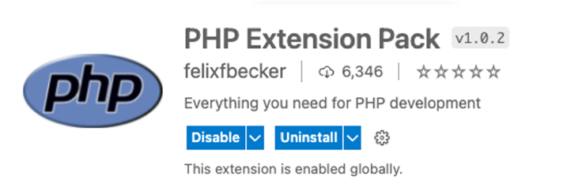
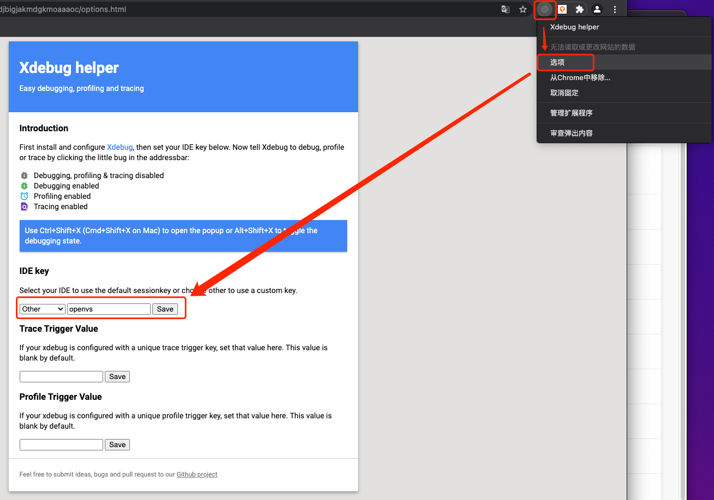
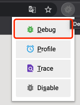
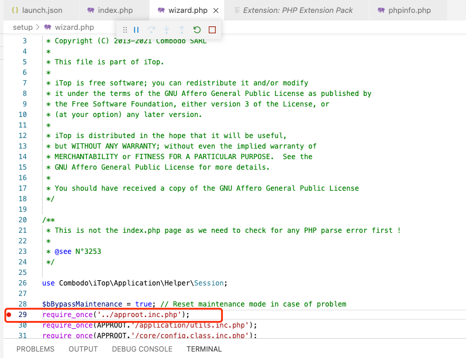
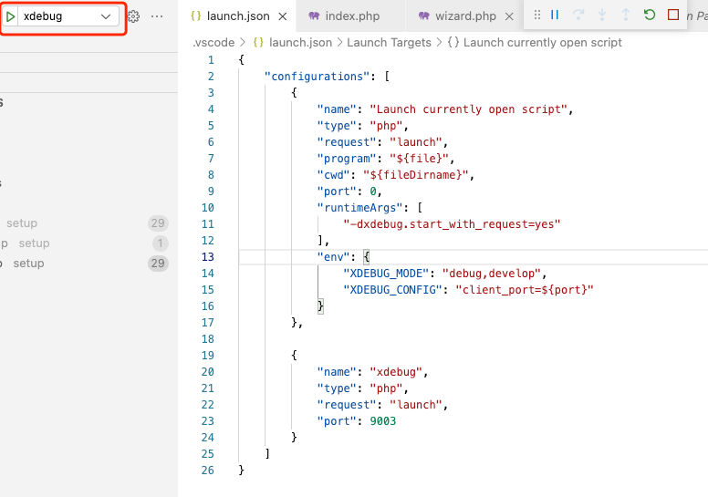
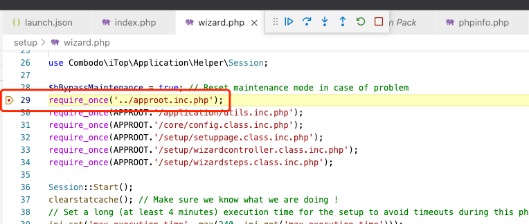

<!--
* @Author: kenan
* @Date: 2021-10-29 11:06:45
* @LastEditors: kenan
* @LastEditTime: 2021-11-01 10:03:28
* @Description: file content
  -->

# ide.yaml使用说明

## 安装smartide-cli

> 详情请见[安装手册](https://smartide.dev/zh/docs/quickstart/)

## 使用远程vm启动smartide
 - 需要保证vm用户环境：建议Ubuntu20+、Git、Docker、docker-compose命令
```bash
smartide start --host 20.198.250.255 --username {host-username} –password {host-password} --repourl https://github.com/SmartIDE/iTop --branch develop --filepath .ide/.ide.yaml -d

```
## 启动Apache服务
```bash
# 设置Git权限
git config core.filemode false
# 设置访问权限
chmod -R 777 /home/project
# 启动
apache2ctl -k start
```
## 安装PHP依赖插件

> 在弹出浏览器中安装如下插件

- PHP Extension Pack
  
  
## 调试
### 启动Xdebug调试
```bash
cd / && ./start-xdebug.sh 9003 openvs
```
### 浏览器插件调试方式：Chrome Xdebug helper扩展安装及设置
- 安装参考：https://github.com/mac-cain13/xdebug-helper-for-chrome
- 设置：
  
  
- 开启：
  
  
### URL参数方式
- URL中加入?XDEBUG_SESSION=openvs参数，如：
  `http://localhost:8080/pages/UI.php?XDEBUG_SESSION=openvs`
### 设置断点
- setup/wizard.php
  
  
### 启动调试

  
### 触发断点
- 访问：http://localhost:8080/
- 触发open vscode断点
  
  
